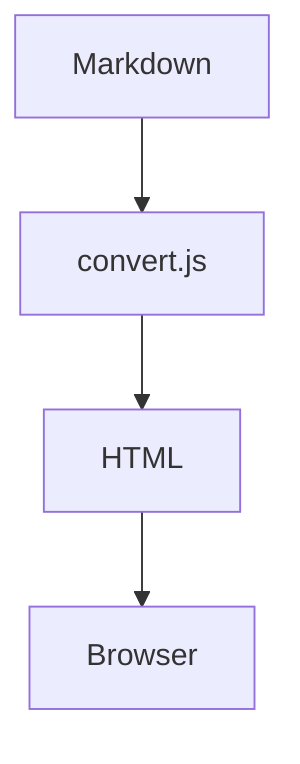

# prev-mark showcase

A single document that exercises every rendering feature. Use it to visually
check the preview (`npm run demo`) or as a fixture for the automated tests
(`npm test`).

## Headings

# H1
## H2
### H3
#### H4
##### H5
###### H6

## Inline formatting

Plain text with **bold**, *italic*, ~~strikethrough~~, and `inline code`.
A [link to the repo](https://github.com/asana17/prev-mark.nvim).

## Syntax-highlighted code blocks

JavaScript:

```javascript
function greet(name) {
  const message = `Hello, ${name}!`;
  console.log(message);
  return message;
}
```

Python:

```python
def fib(n: int) -> int:
    """Return the nth Fibonacci number."""
    a, b = 0, 1
    for _ in range(n):
        a, b = b, a + b
    return a
```

Rust:

```rust
fn main() {
    let nums = vec![1, 2, 3];
    let sum: i32 = nums.iter().sum();
    println!("sum = {}", sum);
}
```

Lua:

```lua
local M = {}
function M.setup(opts)
  M.options = vim.tbl_deep_extend("force", {}, opts or {})
end
return M
```

Shell:

```bash
#!/usr/bin/env bash
# Render every markdown file in a directory.
dir="${1:-.}"
for f in "$dir"/*.md; do
  echo "Rendering $f"
  node convert.js "$f" preview.css "${f%.md}.html"
done
```

## ASCII figure (bare code fence)

A figure drawn with `|`, `-` and `+`. Because this fence has no language
tag it is left as plain monospace, so it stays aligned exactly like in the
editor (no syntax coloring applied):

```
+-------------+       +-------------+       +-------------+
|  Markdown   | ----> |  convert.js | ----> |   Browser   |
+-------------+       +-------------+       +-------------+
      |                     |                     |
      v                     v                     v
   *.md file           HTML + CSS           live preview
```

Plain text table figure:

```
  name     | role      | active
 ----------+-----------+--------
  alice    | admin     |   yes
  bob      | developer |   no
```

## Math (KaTeX)

Inline math such as $E = mc^2$ and $\sum_{i=1}^{n} i = \frac{n(n+1)}{2}$.

Block math:

$$
\int_{-\infty}^{\infty} e^{-x^2} \, dx = \sqrt{\pi}
$$

## Diagram (Mermaid)



## Table

| Feature        | Library       | Rendered |
| -------------- | ------------- | :------: |
| Highlighting   | highlight.js  |    ✅    |
| Math           | KaTeX         |    ✅    |
| Diagrams       | Mermaid       |    ✅    |

## Blockquote and list

> Preview your Markdown in the browser with `:PrevMark`.
> It auto-reloads on save.

1. First item
2. Second item
   - nested bullet
   - another one
3. Third item

## Horizontal rule

---

Done.
